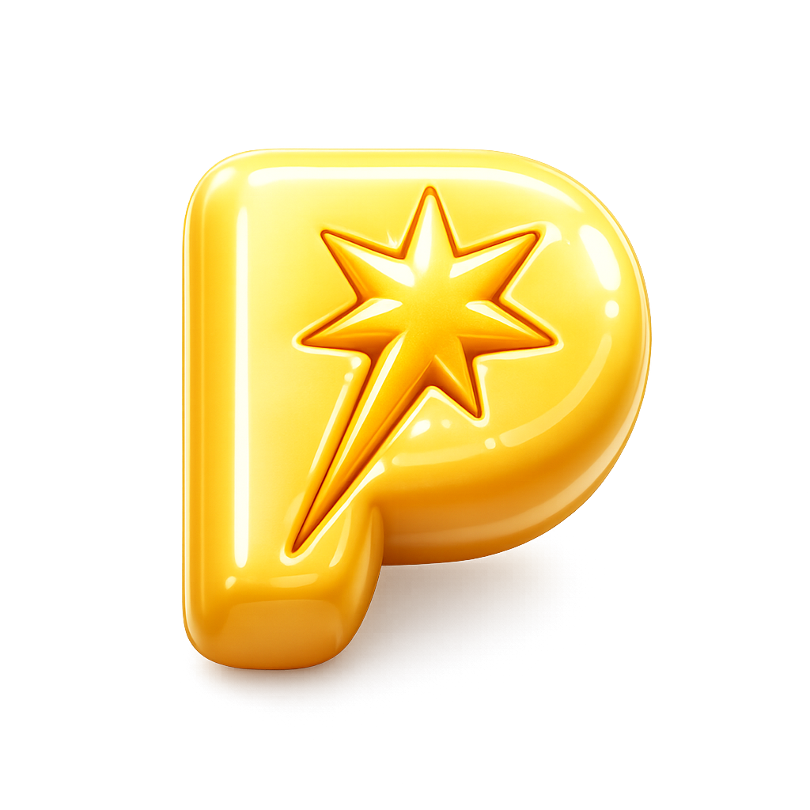

<div align="center">
  
  <h1>⚡️ PopQuiz ⚡️</h1>
  <p><strong>Know Your Trade. Win The Night.</strong></p>
  <p>
    <a href="https://react.dev/"></a>
    <a href="https://vitejs.dev/"></a>
    <a href="https://tailwindcss.com/"></a>
    <a href="https://www.framer.com/motion/"></a>
    <a href="https://vercel.com/"></a>
  </p>
</div>

<br />

> ⚠️ **WARNING:** This is not your average quiz app. It's a high-octane, streak-rewarding, ego-checking arena for crypto natives.

## 👾 What is this?

**PopQuiz** is a blazing-fast, client-side trading assessment protocol disguised as a quiz app. It randomly curates questions from an internal database, calculates performance metrics in real-time, and generates a dynamic, QR-embedded scorecard that players can share. 

If you don't know the difference between a Beta Play and an Awakening Asset, you're going to get liquidated.

## 🏗️ Architecture

Under the hood, we are running a heavily optimized, zero-lag stack:
- **`React 19`** - For that concurrent rendering magic.
- **`Vite`** - HMR so fast you'll think you're working locally on the server.
- **`Tailwind CSS v4`** - Utility-first styling for maximum drip, zero bloat.
- **`Framer Motion`** - GPU-accelerated micro-interactions.
- **`FluentUI 3D`** - We pull raw 3D assets to make the UI pop.
- **`React-QR-Code`** - On-the-fly SVG generation for scorecard sharing.

## 🚀 Quick Start (Local Dev)

You want to run this locally? Easy. 

```bash
# 1. Clone the repo
git clone https://github.com/ilhanEdu/popquiz.git

# 2. Enter the matrix
cd popquiz

# 3. Install the dependencies (grab a coffee, npm takes a sec)
npm install

# 4. Spin up the dev server
npm run dev
```
Smash that `http://localhost:3000` link in your terminal.

## 📂 Directory Structure

```text
popquiz/
├── assets/          # Static heavy-lifting (images, raw assets)
├── public/          # Root public assets
├── src/
│   ├── components/  # The building blocks (Quiz, Results, Scorecard, Welcome)
│   ├── App.tsx      # The main router & state manager
│   ├── data.ts      # The brains. All the questions live here.
│   ├── types.ts     # TypeScript interfaces because we aren't savages
│   └── utils.ts     # Helper functions (array shufflers, math wizards)
├── index.html       # The entry point
└── package.json     # The blueprint
```

## 🧠 The Question Engine
Questions are stored as a strict generic array of `Question` interfaces. The engine automatically shuffles the pool via `src/utils.ts` and injects exactly 15 questions per round. Emojis and visual feedback are mapped dynamically based on the question's `topic` enum.

## 🚢 Deployment

Ready to ship to prod? This repo is heavily optimized for edge networks like **Vercel**. 
1. `npm run build`
2. Connect repo to Vercel.
3. Deploy. Zero config needed.

---
<div align="center">
  <i>"Stay liquid, stay learning."</i>
</div>
